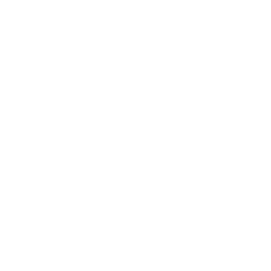

# Karma
## Karma is an awareness video for our ocean.
[Link to Karma](https://lucienchotard.github.io/karma/)

# Getting started
Simply click on the fish to play the video.



# An interactive video
Two videos are playing :
```
- Click on the middle button to switch videos and see what is going on.

- Put your mouse over the little bar to make the timeline appear : You can now  control the play/pause button, the volume and come back to a scene.
```
# Contributors
- Designed by Aurélie DO
- Video produced by Céline SUNG

# Autor
Lucien CHOTARD

# License 
[MIT](https://choosealicense.com/licenses/mit/)
